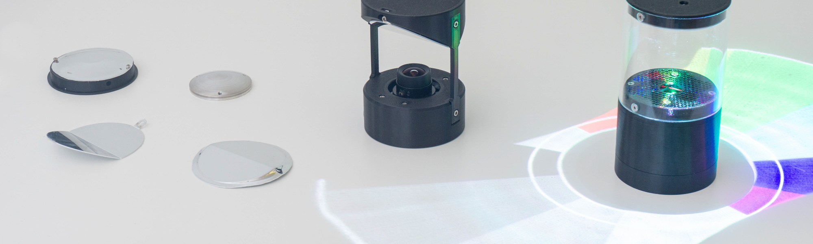
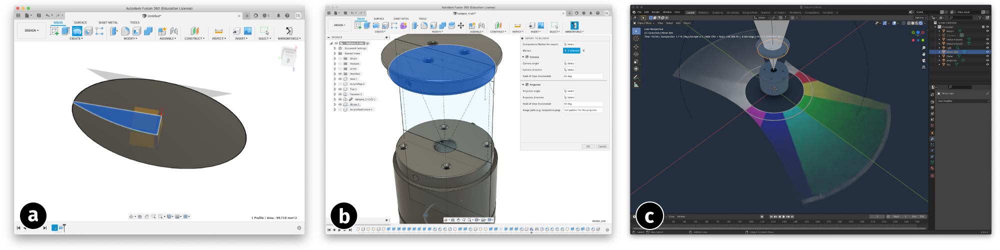

# MirrorForge - Rapid Prototyping of Complex Mirrors for Camera and Projector Systems



This is the repository for [MirrorForge: Rapid Prototyping of Complex Mirrors for Camera and Projector Systems](...), a processing and simulation pipeline to prototype complex mirror shapes by thermoforming or bending coated polystyrene sheets.



## Installation

Copy the `addin` directory to your Fusion360 extension folder.  
Install [Blender](https://www.blender.org/download/) and the [BlendLuxCore](https://luxcorerender.org/download/) Blender-Plugin.  
In Blender enable the BlendLuxCore plugin in the plugins-tab in preferences.

Make sure to install a version of Blender which is explicitly supported by LuxCore.

## Quickstart

In Fusion360 start the Add-In via Tools > Add-Ins > Add-Ins (Tab) > Run  
Enable `Run on Startup` to permanently enable the MirrorForge Add-In.

## Examples

TODO

Open `circular_projection.blend` to familiarize yourself with a rendering setup featuring a laser pico-projector.
The example file `twoway_camera.blend` is a camera setup.

## Citation

You can find the open-access paper in the ACM library: [Mirrorforge.pdf](https://dl.acm.org/doi/10.1145/3490149.3501329)

If you want to use and cite this work:

```
@inproceedings{10.1145/3490149.3501329,
    author = {Getschmann, Christopher and Mthunzi, Everett and Echtler, Florian},
    title = {MirrorForge: Rapid Prototyping of Complex Mirrors for Camera and Projector Systems},
    year = {2022},
    url = {https://doi.org/10.1145/3490149.3501329},
    doi = {10.1145/3490149.3501329},
    booktitle = {Sixteenth International Conference on Tangible, Embedded, and Embodied Interaction},
    location = {Daejeon, Republic of Korea},
    series = {TEI '22}
}
```
